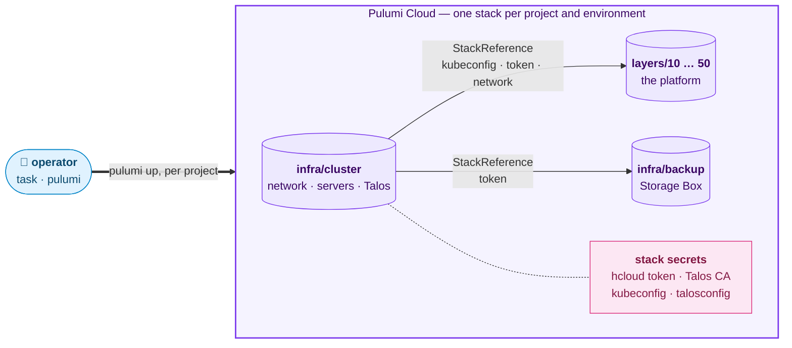
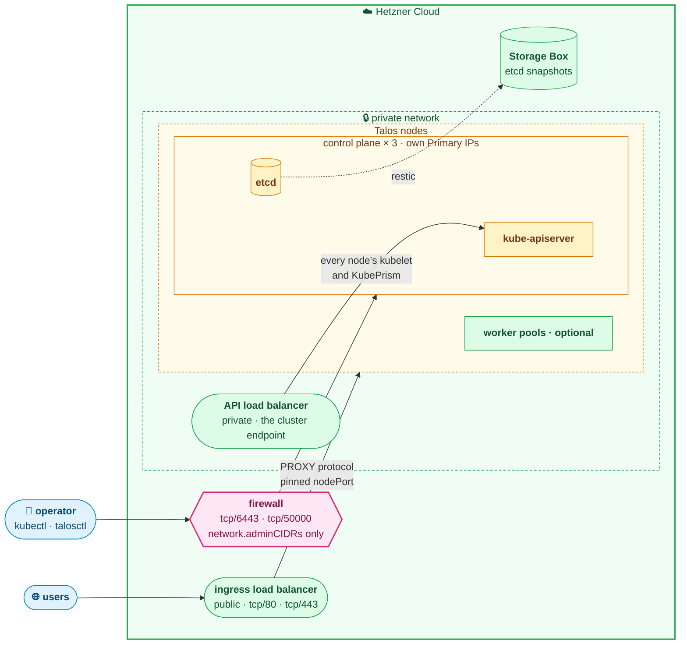
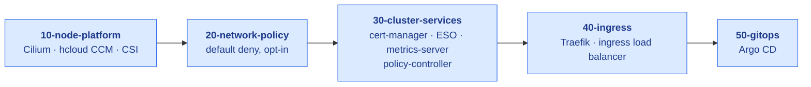

# hetzner-iac

[](https://github.com/oleg-tkachuk/hetzner-iac/actions/workflows/ci.yaml)
[](https://github.com/oleg-tkachuk/hetzner-iac/releases/latest)
[](go.mod)
[](LICENSE)

[](https://www.pulumi.com)
[](https://docs.siderolabs.com/talos)
[](https://cilium.io)
[](https://argo-cd.readthedocs.io)
[](https://www.hetzner.com/cloud)

Kubernetes on [Hetzner Cloud](https://www.hetzner.com/cloud), running
[Talos Linux](https://www.siderolabs.com/talos-linux) and built with the
[Pulumi Go SDK](https://www.pulumi.com/docs/iac/languages-sdks/go/).

[Hetzner](https://www.hetzner.com/) has no managed Kubernetes, so this
repository builds the cluster itself — a Talos control plane on a private
network — and then deploys the platform onto it in independent, idempotent
layers.

**Pulumi Cloud — state and secrets.** Each project is its own stack. The
cluster tier publishes what the others need, and they read it through a
StackReference rather than a copy.



**Hetzner Cloud.** The firewall is the only way in for an operator, the API
load balancer has no public interface, and users reach the platform through
the ingress load balancer.



**The platform**, applied in order, each layer independent and idempotent.



## Contents

- [Quick start](#quick-start) — from nothing to a running platform
- [Getting back in](#getting-back-in) — a new machine, or a new console
- [Prerequisites](#prerequisites) — what has to be installed
- [Commands](#commands) — the handful worth knowing
- [Configuration](#configuration) — the topology file and stack config
- [Documentation](#documentation) — the rest, by document
- [Layout](#layout) — where things live in the tree
- [License](#license)

## Quick start

You need:

- a [Hetzner Cloud API](https://docs.hetzner.cloud/reference/cloud) token with
  read+write scope ([how to create one](https://docs.hetzner.com/cloud/api/getting-started/generating-api-token/));
- a [Pulumi Cloud](https://app.pulumi.com/signup) account for state, or your
  own S3 bucket, which changes step 1 only:
  [configuration.md](docs/configuration.md#keeping-state-in-your-own-s3-bucket);
- the tools in [Prerequisites](#prerequisites);
- optionally, a **domain**, needed only to reach the cluster from outside.
  `metadata.domain` in the topology (`platform.example.com`, with
  `metadata.dnsZone: example.com` when Hetzner serves the zone) drives the DNS
  records `40-ingress` writes and the certificate `30-cluster-services` orders;
  with the zone hosted elsewhere, leave `metadata.dnsZone` empty and write the
  two records yourself.
  Without it every command below still works, and the Argo CD UI is reached
  with `kubectl port-forward`. See [domain.md](docs/domain.md).

Everything below creates **billable**
[Hetzner resources](https://www.hetzner.com/cloud#pricing);
`task destroy` removes them — every layer, then the cluster.

```bash
# 1. The repository, and the backend that holds the state. An S3 bucket is the
#    same command with its URL, plus PULUMI_CONFIG_PASSPHRASE in the environment.
git clone https://github.com/oleg-tkachuk/hetzner-iac.git && cd hetzner-iac
pulumi login https://api.pulumi.com

# 2. Describe the cluster. Set network.adminCIDRs to the address you apply
#    from, or Talos configuration hangs on a filtered port.
cp infra/cluster/cluster.example.yaml infra/cluster/cluster.dev.yaml
$EDITOR infra/cluster/cluster.dev.yaml

# 3. Create the stack and store the token, encrypted. Never pass it as a task
#    argument: argv is visible to `ps` and lands in the shell history.
task cluster:token stack=dev

# 4. Bake the Talos snapshot. Once per Talos version; idempotent.
task cluster:image:bake stack=dev

# 5. Build the cluster, reading the diff first.
task cluster:plan stack=dev
task cluster:apply stack=dev

# 6. Point every layer at it, then apply them in order. The layers read the
#    token from step 3 through the stack reference.
task platform:init stack=dev
task platform:apply layer=all stack=dev

# 7. Check what you built.
task cluster:kubeconfig stack=dev
task cluster:status stack=dev
task e2e
```

Step 3 prompts with hidden input, or reads standard input so a secret manager
can supply it:

```bash
pass hetzner/token | task cluster:token stack=dev
```

Without `stack=` the task prints its usage and never reads stdin.

- The token is stored as ciphertext in the gitignored
  `infra/cluster/Pulumi.dev.yaml` — the same as `pulumi config set --secret
  hcloud:token` in `infra/cluster`. Only the cluster tier holds it.
- An exported `HCLOUD_TOKEN` wins over the stored one.
- Nodes stay `NotReady` between steps 5 and 6: the cluster tier installs no
  CNI, `layers/10-node-platform` does.
- `task up stack=dev` does steps 5 and 6 in one go, once the stacks exist.

## Getting back in

Everything about the cluster is in the Pulumi stack: state, the encrypted
token, kubeconfig, talosconfig and the Talos secrets bundle. `./kubeconfig` and
`./talosconfig` are gitignored copies written from it.

```bash
# 1. The repository and the backend. Nothing is created.
git clone https://github.com/oleg-tkachuk/hetzner-iac.git && cd hetzner-iac
pulumi login https://api.pulumi.com

# 2. The stacks, and any whose topology file is missing from this clone.
task cluster:stacks

# 3. The credentials, read from the backend; no token, topology or network
#    path to the cluster needed.
task cluster:kubeconfig stack=dev
task cluster:talosconfig stack=dev

# 4. Check they answer.
task cluster:status stack=dev
```

With state in your own S3 bucket, step 1 is `pulumi login 's3://…'` and
`PULUMI_CONFIG_PASSPHRASE` must be exported before step 3:
[configuration.md](docs/configuration.md#keeping-state-in-your-own-s3-bucket).

**Step 4 hangs if your address is not in `network.adminCIDRs`.** The firewall
opens the Kubernetes and Talos APIs to those CIDRs only. Fixing it needs the
topology file, which is gitignored because it names the networks you administer
from and this repository is public — so restore it from wherever you kept it:

```bash
# Restore the topology, add the address, then read the diff before applying.
$EDITOR infra/cluster/cluster.dev.yaml
task cluster:plan stack=dev     # the only change you want is the firewall
task cluster:apply stack=dev
```

Read the plan: a topology rebuilt from `cluster.example.yaml` can differ from
the one the cluster was built with, and a value that forces a replacement
replaces a server.
[operations.md](docs/operations.md#from-a-machine-the-firewall-does-not-know)
covers addresses that are not stable.

## Prerequisites

Tools for building and running a cluster. The checks' own tools are in
[ci.md](docs/ci.md#tools-the-checks-need).

| Tool | Why |
|------|-----|
| [Pulumi](https://www.pulumi.com/docs/install/) 3.261+ | runs everything here; `pulumi login https://api.pulumi.com` before the first task |
| [Go](https://go.dev/dl/) 1.27+ | the programs are Go |
| [Task](https://taskfile.dev/installation/) 3.53+ | the entry points; the [remote Taskfiles](https://github.com/oleg-tkachuk/taskfiles) it includes need 3.53 |
| [hcloud CLI](https://github.com/hetznercloud/cli) | inspection, and baking the Talos image |
| [hcloud-upload-image](https://github.com/apricote/hcloud-upload-image) | Hetzner has no custom-image upload API |
| [talosctl](https://docs.siderolabs.com/talos/v1.13/getting-started/talosctl) | validates the machine config before anything exists; then upgrades, etcd snapshots, clean shutdown |
| [kubectl](https://kubernetes.io/docs/tasks/tools/) | the status tasks, `task cluster:kubeconfig:add` and `task cluster:orphans` |
| [jq](https://github.com/jqlang/jq) | reads single fields out of `pulumi stack output --json` and `hcloud -o json` |
| `restic`, `rclone` | `task cluster:etcd:upload`: restic uploads, prunes and verifies; rclone is its transport, since a Storage Box credential is a password and restic's sftp backend takes only keys |
| [`hubble`](https://github.com/cilium/hubble) | `task cluster:hubble`, which reads the flows `layers/20-network-policy` is built from |

On macOS, `brew bundle` installs all of it except `hcloud-upload-image`:
`go install github.com/apricote/hcloud-upload-image@latest`.

Then install the `talosctl` the topology pins — Homebrew's is usually a minor
ahead, and `task cluster:machine-config:check` refuses a mismatched binary:

    task cluster:talosctl:install

It needs no stack, reads the version from the committed topologies and writes
the binary into `bin/`, which the check prefers over `PATH`.

A task whose tool is missing says what to install.

## Commands

`task` on its own lists every command for operating a cluster. Each cluster
and layer task takes `stack=<name>`, with no default, so a forgotten word
cannot aim a task at the wrong environment. Everything else comes from the
topology file.

| Task | Does |
|------|------|
| `task up` | cluster, then every layer in dependency order |
| `task plan` | preview the cluster and every layer; change nothing |
| `task cluster:status` | nodes, then anything not Running |
| `task platform:status` | every stack's last run, and whether they agree on the cluster |
| `task platform:drift` | every resource changed outside Pulumi |
| `task e2e` | verify a running cluster; read-only |

Full reference: [commands.md](docs/commands.md). The checks and scanners live
in `Taskfile.dev.yaml`, for working on this repository:
[commands.md](docs/commands.md#working-on-this-repository).

## Configuration

Everything that shapes a cluster is in `infra/cluster/cluster.<stack>.yaml`,
copied from [cluster.example.yaml](infra/cluster/cluster.example.yaml) and
validated as you type it. Stack config holds the Hetzner token and what each
layer deploys:

| Key | Where | Meaning |
|-----|-------|---------|
| `hcloud:token` | [`infra/cluster`](infra/cluster) | Hetzner API token (secret) |
| `<layer>:clusterStackRef` | every [layer](layers) | `<org>/hetzner-cluster/<stack>`; written by `platform:init` |
| `node-platform:cni` | [`10-node-platform`](layers/10-node-platform) | which CNI to install, default `cilium` |
| `network-policy:enabled` | [`20-network-policy`](layers/20-network-policy) | create the policies; off by default, because the first one to select an endpoint denies what it does not name |
| `cluster-services:acmeEmail` | [`30-cluster-services`](layers/30-cluster-services) | enables the Let's Encrypt ClusterIssuer; omit it and none is created |
| `cluster-services:acmeStaging` | [`30-cluster-services`](layers/30-cluster-services) | order from Let's Encrypt's staging endpoint: untrusted certificates, and where a new domain's first attempt belongs |
| `ingress:loadBalancerType` | [`40-ingress`](layers/40-ingress) | [Hetzner load balancer](https://www.hetzner.com/cloud/load-balancer) type, default `lb11` |
| `backup:storageBoxType` | [`backup`](infra/backup) | [Storage Box](https://www.hetzner.com/storage/storage-box) type, default `bx11` |

The domain, and Argo CD's hostname with it, is `metadata.domain` in the
topology, not stack config: [domain.md](docs/domain.md).
Everything else: [configuration.md](docs/configuration.md).

## Documentation

| Document | Covers |
|----------|--------|
| [design.md](docs/design.md) | why it is shaped this way: layers, the committed topology, encryption, version pinning |
| [networking.md](docs/networking.md) | how a request reaches a pod, how pod traffic crosses nodes, and the default deny |
| [domain.md](docs/domain.md) | what being reachable from outside needs, and in what order |
| [configuration.md](docs/configuration.md) | the topology file, stack config, state and secrets |
| [commands.md](docs/commands.md) | every task, as tables |
| [operations.md](docs/operations.md) | running a cluster that exists: stopping, starting, the checks, kubectl |
| [recovery.md](docs/recovery.md) | upgrades, etcd snapshots and restoring from one |
| [ci.md](docs/ci.md) | how changes land, the scanners, what the suites prove, chart upgrades |
| [ROADMAP.md](ROADMAP.md) | what is intended next, and what is deliberately not planned |
| [adr/](docs/adr/) | the decisions this is built on: what was decided, and the consequences accepted |
| [SECURITY.md](.github/SECURITY.md) | reporting a vulnerability, and what is in scope |

## Layout

| Path | Holds |
|------|-------|
| [infra/cluster/](infra/cluster) | the Hetzner cluster: network, firewall, control plane, workers |
| [layers/](layers) | one Pulumi project per platform layer |
| [internal/pkg/](internal/pkg) | the implementation: the cluster's own description, Pulumi components, the output contract, chart pins, values |
| [internal/ci/](internal/ci) | the repository's own gates: the cross-file contracts nothing else compares |
| [tools/](tools) | the small commands: chart pins, topology, orphaned resources, stack state, snapshot and secrets |
| [test/e2e/](test/e2e) | verification against a running cluster |
| [tasks/](tasks) | the cluster and layer task definitions the root Taskfile includes |
| [Taskfile.dev.yaml](Taskfile.dev.yaml) | the second entry point: the checks, the scanners, the formatters and the chart pins |
| [docs/](docs) | the documents above |

### Not a Go library

`go get` on this module does not resolve, by design: the module path has no
`/vN` suffix while release tags are v2+, everything outside `internal/` is a
`main` package, and `internal/` cannot be imported from another module. The
tags are for semantic-release notes. Clone it and run the tasks.

## License

MIT — see [LICENSE](LICENSE).
