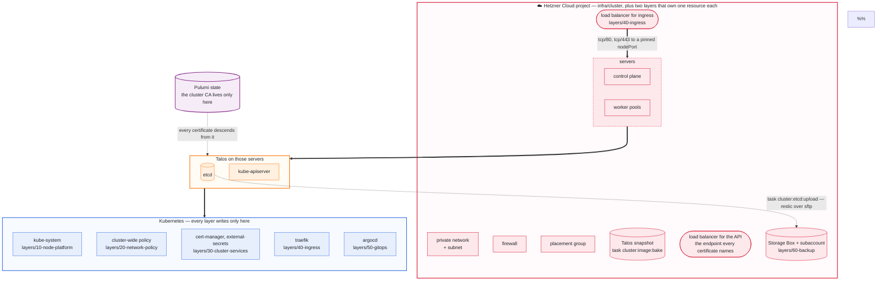
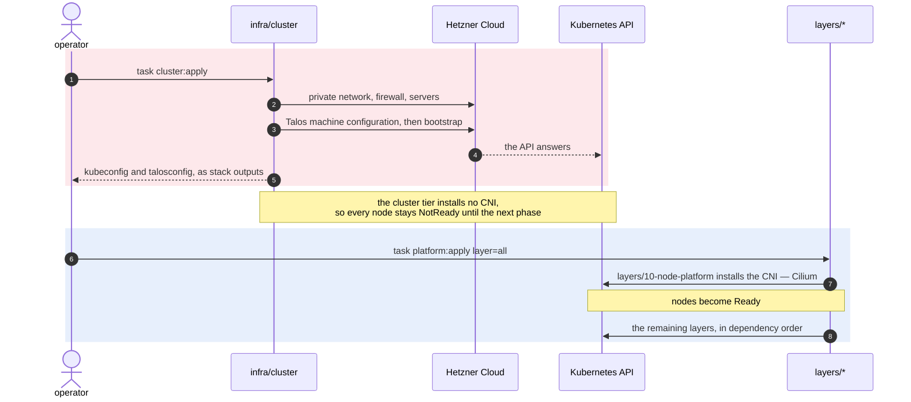

# Why it is shaped this way

Four decisions explain most of the repository. Each one has a cost, and the
cost is named.

## What lives inside what

The seam this repository is built on: one project writes to Hetzner, and every
layer writes only to Kubernetes. Destroying the cluster tier takes everything
above it; destroying a layer takes only its own namespaces.

The ingress load balancer is the one resource that crosses the seam, and it
crosses from the wrong side on purpose: a layer asks Kubernetes for a Service,
and the cloud controller manager turns that into a Hetzner resource. No layer
holds a Hetzner credential to do it with.

The box outside all three is the one worth staring at. Every certificate in
the cluster descends from a secrets bundle that exists only in Pulumi's state:
`Protect` stops a destroy from taking it, which is not the same as a second
copy existing anywhere. It is also what makes an etcd snapshot restorable at
all, so `task cluster:secrets:export` writes it somewhere else — see
[recovery.md](recovery.md#the-two-halves-of-a-backup).

## Each layer is its own Pulumi project

A layer can be previewed, applied and destroyed on its own, and reads the
cluster's kubeconfig through a `StackReference` rather than sharing state with
it. Upgrading Cilium does not mean planning a change to Argo CD.

Independence has a boundary worth stating: layers are independently
*appliable*, not order-free. On an empty cluster nothing schedules before the
cloud controller manager clears Talos's `uninitialized` taint, and nothing
networks before the CNI. `task platform:apply layer=all` walks them in order; the
order lives once, in the root Taskfile, and CI derives its matrix from the
same list through `task -t Taskfile.dev.yaml layers`.

## Every stack output is a named constant

A stack output is an interface, and half its consumers are not Go. The tier's
`kubeconfig` and `talosconfig` are read by `cluster:kubeconfig` and
`cluster:talosconfig`; the backup layer's five are read by `cluster:etcd:upload`
through jq. Those callers cannot import a constant, so they spell the name
again — and when the two spellings drift nothing errors: `pulumi stack output`
prints nothing, jq answers `null`, and the task reports the layer as unapplied,
which points the operator at an apply that will not fix it.

So every export in every project names a constant, whether or not a machine
reads it today. Uniform rather than "name the ones that matter", because who
reads an output changes: `ingressIp` is read by a person now and by whatever
writes DNS records later, and a rename at that point is a rename in two
languages. It also makes the published set greppable —
`grep Output internal/pkg/clusterref layers` is the whole list.

Two tests hold it, and they catch different halves.
`TestLayers_ExportOnlyNamedOutputs` refuses an export written as a literal.
`TestOutputs_ReadByShellAreDeclaredInGo` takes every name a taskfile reads and
requires a constant to publish it, which catches a rename on either side.
`internal/pkg/clusterref` additionally pins each constant's value, and
`TestOutputNames_ArePinnedWithoutException` counts the pins against the
constants, because that list had gone stale by three.

## What Pulumi owns, and what it deliberately does not

The `pulumi-hcloud` provider offers 32 resource types. This repository uses
eleven, and the gap is not all oversight — three quarters of it is a decision.

Owned here: the network and its subnet, the firewall, the placement group, the
servers, the API load balancer with its network attachment, service and
label-selector target, the ingress load balancer with the same four, its `A`
and `AAAA` records, and the Storage Box with its subaccount.

**Not owned, and not to be.** Each of these has one reason:

| Thing | Who owns it | Why not Pulumi |
|---|---|---|
| Volumes behind a `PersistentVolumeClaim` | the CSI driver | dynamic provisioning is the point; Pulumi owning them means abandoning claims. `cluster:orphans` covers the gap |
| A load balancer for a workload's `Service` | the CCM | the workload's Service owns it. The *ingress* one moved because the platform owns that one |
| Objects inside a Helm release | Helm | Pulumi owns the Release. Owning both puts two reconcilers on one object |
| The Talos snapshot | `task cluster:image:bake` | Hetzner has no image-upload API. `hcloud.Snapshot` takes a `ServerId`, so Pulumi could take the snapshot but not write the disk — the imperative half stays either way |
| A Talos or Kubernetes upgrade | `talosctl` | a procedure with an order, not a desired state |
| Workloads | Argo CD | that is what the GitOps layer is for |

**DNS records are `40-ingress`'s**, because that layer is where the load
balancer's address is known. The zone is LOOKED UP, never created: a zone is
delegated once, by pointing a registrar's `NS` records at Hetzner's
nameservers, and that delegation outlives any cluster here — a zone this stack
owned would be a zone `pulumi destroy` deletes, with every record in it. Both
an `A` and an `AAAA`, because a Hetzner load balancer has both and an
IPv4-only record fails for exactly the clients nobody tests from.

The domain may be registered anywhere. What has to be at Hetzner is the
authoritative DNS, and `metadata.dnsZone` may be left empty when it is not —
the layer then says the records are somebody else's to write rather than
staying silent.

One thing could still move and has not, and it is measured:

- **Primary IPs.** Every public address today is implicit and carries
  `auto_delete: true`, so a server replacement takes its address with it — and
  servers here are `DeleteBeforeReplace`, so that happens on any replacing
  change, not only on a teardown. An explicit `hcloud.PrimaryIp` survives it,
  at the same cost while attached, and keeps billing while it is not. It does
  **not** help the address DNS would point at: that is a load balancer's, and
  an LB IPv4 is neither a primary nor a floating IP — `floatingIpAssignment`
  takes a `ServerId` and nothing else.

One API note worth keeping, because it costs an afternoon otherwise: Hetzner
serves these from two bases. Storage Boxes are on the unified API —
`api.hetzner.com/v1/storage_boxes` — and answer `api route not found` on
`api.hetzner.cloud/v1`. Zones are the other way round. The same project token
reaches both.

## The cluster is a committed file

`infra/cluster/cluster.<stack>.yaml` describes the topology, so a cluster is
reviewable in a diff before it exists and reproducible from a clone. The
template for it is
[cluster.example.yaml](../infra/cluster/cluster.example.yaml). It is
sparse — anything omitted keeps the default in `internal/pkg/hetzner` — and it is
validated against the same code the Pulumi program runs, so the check cannot
drift from the thing it checks.

One field keeps that file out of git: `network.adminCIDRs` is the operator's
own address. `cluster.example.yaml` is committed with an RFC 5737 placeholder
instead.

The consequence is that CI cannot preview the cluster tier — a runner has no
topology. Cluster-tier drift is checked by hand with `task cluster:plan`.

## The cluster tier stops at "a Kubernetes API that answers"

It installs no CNI: Talos would otherwise install Flannel, which would then
have to be removed before Cilium could take over. Nodes are `NotReady` until
`layers/10-node-platform` runs. That is the handover point, not a failure — and
it is why that layer also owns the cloud controller manager, which cannot be
scheduled onto a node no CNI has made Ready.

## Three control planes, and etcd on the private network

The shipped shape is three control planes behind a load balancer, which is the
smallest number that means anything: validation refuses an even count, because
a second member tolerates no more failures than one while costing twice as
much. The three land in a spread placement group, so they are three failure
domains rather than three processes on one machine.

The load balancer is not a convenience. It is the endpoint signed into every
certificate, which is what makes a member replaceable — with a node's own
address there, replacing that node reissues everything that named it.

One thing HA needs that a single node never did: **etcd has to advertise
inside the private network.** Left alone it advertises whichever address the
node has first, and on Hetzner that is the public one — where the perimeter
firewall opens tcp/6443 and tcp/50000 and nothing else, so the members cannot
reach each other's tcp/2380. Measured on the first three-member cluster built
here: two members, one of them a learner for ever, and the third never
joining. `internal/pkg/hetzner.BuildEtcdPatch` pins it, in a document applied to
control planes only — Talos refuses the section on a worker, which
`task cluster:machine-config:check` says out loud.

Verified by turning a member off: the API kept answering through the load
balancer and Kubernetes kept accepting writes on the remaining two.

## What the cluster encrypts, and what it does not

Kubernetes Secrets are encrypted at rest without this repository doing
anything: the Talos secrets bundle the Pulumi provider generates carries a
secretbox key, and Talos wires it into the API server's
`--encryption-provider-config`. That covers the `secrets` resource and nothing
else.

The volumes themselves are encrypted by two `VolumeConfig` documents in the
cluster patch — STATE, which holds the machine config and the node's
certificates, and EPHEMERAL, which holds `/var` and so etcd's data directory.
Without them a restored snapshot or a volume attached to another machine is
readable, which is a far cheaper attack than reaching the running node.

The key provider is `nodeID`, derived from the node's UUID. It is deliberately
not protection against someone who can already run commands on the node —
Talos offers `tpm` for that, which needs SecureBoot and a TPM a Hetzner Cloud
instance does not have, and `kms`, which needs a key server this repository
does not run. `static` would put the passphrase in the machine config beside
the data it protects.

Talos has no in-place encryption: enabling this on a node that already exists
means wiping STATE, which is where its configuration lives. On a cluster that
is already running, the path is `task cluster:destroy` and a fresh
`cluster:apply`, then the layers.

## What the platform outranks, and what it does not

Under node memory pressure the kubelet evicts by QoS class and then by
priority, so a platform component with no priority is ranked beside the
workloads it exists to serve. The ones that hurt are not symmetrical: losing
the CSI node plugin leaves every pod with a volume on that node Pending, and
losing ingress means nothing reaches the cluster from outside at all.

So Traefik, cert-manager, the CSI controller and the cloud controller manager
ask for `system-cluster-critical`, and the CSI node plugin — a DaemonSet whose
loss is node-level rather than cluster-level — asks for
`system-node-critical`. Cilium and metrics-server set their own; the values
here only add what a chart does not already do.

Argo CD deliberately asks for nothing. It reconciles rather than serves, and a
cluster whose Argo CD has been evicted keeps running everything it was told to
run. `internal/pkg/chartsettings` holds the reasoning and the render check
proves each value reaches the rendered pod spec, quoting included — three of
the four charts quote it and Traefik does not.

## Every chart version is pinned in one place

`internal/pkg/charts` is the registry; floating tags are rejected by validation rather
than by convention. `charts:outdated` compares each pin against its
upstream repository, and Renovate opens one pull request per chart — see
[ci.md](ci.md#chart-upgrades-arrive-as-pull-requests).

## Versions

Both the Talos and the Kubernetes version are pinned in the topology, and
neither derives from the other. An empty `kubernetes.version` takes
`DefaultKubernetesVersion` — also pinned — rather than whatever the configured
Talos release happens to ship.

That is not caution for its own sake. Deriving one from the other made a Talos
patch bump able to move Kubernetes a whole minor with no diff and no decision,
and it did: the first bring-up landed on v1.36.0, new enough that
`kube-apiserver` had removed a flag the machine config was passing, and the
control plane never started.

Upgrading Talos means bumping `talos.version` in the topology, re-running
`task cluster:image:bake`, then `task cluster:upgrade:talos`. Nodes are
upgraded in place and never replaced, which is why the server resource ignores
changes to its image.

`talos.architecture` is the other half of the same pin, and it is a replace
rather than an upgrade: `x86` and `arm` are different images on different
server types, so switching means a new snapshot and new nodes. The topology is
the single place that says which — the factory URL, the server types the
validator will accept, and the defaults those types fall back to all read that
one field. See
[configuration.md](configuration.md#cpu-architecture) for the costs and for
why Arm availability has to be checked per project rather than assumed.

## The Hetzner token travels with the kubeconfig

The cluster tier exports the token and every layer reads it through the same
stack reference that carries the kubeconfig, so it is typed once.

The objection to exporting a credential — that it lands in the state of every
referencing stack — is already true of the kubeconfig and the talosconfig on
that channel, both strictly more powerful than an API token.

## Asking the real tool

Three checks run offline against the software itself rather than against this
repository's own tests, because a test agreeing with the code that produced it
proves nothing about what Helm or Talos will accept:

| Check | Asks |
|-------|------|
| `charts:validate` | the upstream repositories, that every pin is an exact version that resolves |
| `charts:render-check` | `helm template`, then the pinned Kubernetes version's own schema |
| `task cluster:machine-config:check` | `talosctl`, that the machine configuration is one it would apply |

`task -t Taskfile.dev.yaml verify` runs all three. They need `helm`, a `talosctl` matching the
pinned Talos minor, and a running Docker.

What they have caught, none of which would have failed a `pulumi up`:

- `kubeProxyReplacment` — one letter short. Helm accepts an unknown key
  silently, even for a chart shipping a `values.schema.json`, so the default
  stayed and the rendered output read `kube-proxy-replacement: "false"`. Talos
  runs with kube-proxy disabled, so that is a cluster where every ClusterIP
  blackholes, started successfully.
- A DaemonSet needing host access in a namespace Talos does not exempt from
  Pod Security Admission — its pods are never created, and Helm waits out its
  whole timeout with nothing to show.
- `machine.network.hostname`, which Talos rejects outright.
- A Talos version pinned ahead of what the provider's generator knows.

The first is why [internal/pkg/chartsettings](../internal/pkg/chartsettings) exists: the handful
of values whose misspelling fails silently are constants there, and
`render-check` asserts the **effect** each one has on the rendered chart rather
than that the key was set.

## What a run prints

One vocabulary, printed from two places: [internal/pkg/pulumilog](../internal/pkg/pulumilog) in
the layers and the taskfiles' own lines, both borrowed from the
[taskfiles](https://github.com/oleg-tkachuk/taskfiles) library so that `task`
and `pulumi up` read as one tool.

| glyph | means | survives a pulumi run |
|-------|-------|-----------------------|
| `◉` | work starting | no |
| `✔` | work finished | no |
| `○` | deliberately not done | **yes** |
| `▲` | configured, and will not do what it looks like | **yes** |
| `✖` | failed — tasks only | — |

The line is `<glyph> <scope> · <area> · <what happened>`, with `→` for "became"
or "went to". `✖` has no Go counterpart on purpose: a layer reports failure by
returning an error, which Pulumi formats itself.

The last two glyphs are the point. A layer that installs cert-manager and no
ClusterIssuer is the most confusing thing this repository can do, so those
lines go to Pulumi's permanent diagnostics and are still on screen when the run
ends. Progress lines are ephemeral, or the summary is one line per release and
nobody reads it.

`TestTaskGlyphs_MatchThePulumiLogger` holds the two halves equal. The Go side
had said its glyphs match the taskfiles "exactly" since it was written, and
nothing checked it.

`NO_COLOR` drops the escape codes and keeps the glyphs. A TTY check would be
wrong rather than merely unhelpful: a Pulumi program's output is captured by
the CLI over gRPC, so stdout is never a terminal.
