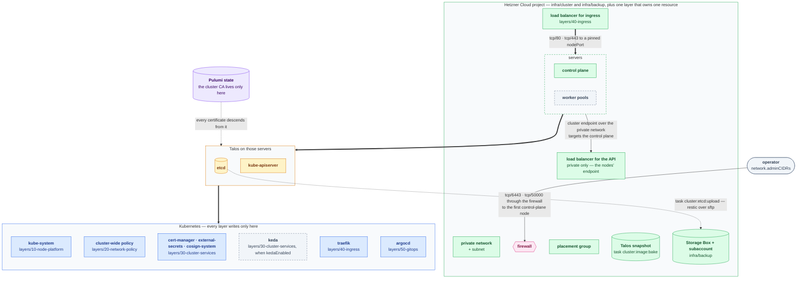
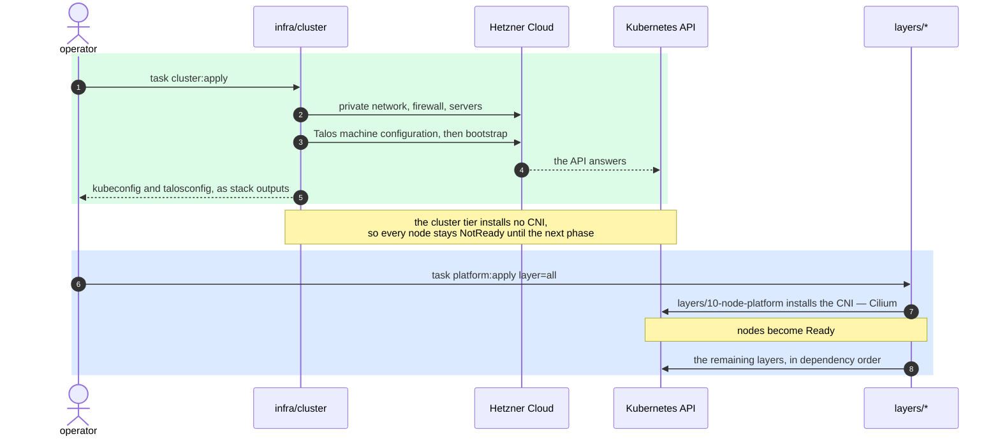

# Why it is shaped this way

Each decision below has a cost, and the cost is named. How packets move —
ingress, the API path, pod routing, network policy — is
[networking.md](networking.md).

## What lives inside what

The seam this repository is built on: the projects under `infra/` write to
Hetzner, and a layer writes to Kubernetes. Destroying the cluster tier takes
everything above it; destroying a layer takes only its own namespaces.

```mermaid
flowchart TB
    subgraph hetzner ["Hetzner Cloud project — infra/cluster and infra/backup, plus one layer that owns one resource"]
        direction TB
        net["<b>private network</b><br/>+ subnet"]
        fw{{"<b>firewall</b>"}}
        pg["<b>placement group</b>"]
        snap[("<b>Talos snapshot</b><br/>task cluster:image:bake")]

        subgraph servers ["servers"]
            direction LR
            cp["<b>control plane</b>"]
            wk["<b>worker pools</b>"]
        end

        apilb["<b>load balancer for the API</b><br/>private only — the nodes' endpoint"]
        inglb["<b>load balancer for ingress</b><br/>layers/40-ingress"]
        box[("<b>Storage Box + subaccount</b><br/>infra/backup")]
    end

    subgraph talos ["Talos on those servers"]
        direction LR
        etcd[("<b>etcd</b>")]
        api["<b>kube-apiserver</b>"]
    end

    subgraph k8s ["Kubernetes — every layer writes only here"]
        direction TB
        ks["<b>kube-system</b><br/>layers/10-node-platform"]
        pol["<b>cluster-wide policy</b><br/>layers/20-network-policy"]
        cmns["<b>cert-manager · external-secrets · cosign-system</b><br/>layers/30-cluster-services"]
        kedans["<b>keda</b><br/>layers/30-cluster-services, when kedaEnabled"]
        tns["<b>traefik</b><br/>layers/40-ingress"]
        argons["<b>argocd</b><br/>layers/50-gitops"]
    end

    trust[("<b>Pulumi state</b><br/>the cluster CA lives only here")]
    op(["<b>operator</b><br/>network.adminCIDRs"])

    trust -.->|"every certificate descends from it"| talos
    servers ==> talos
    talos ==> k8s
    inglb ==>|"tcp/80 · tcp/443 to a pinned nodePort"| servers
    servers -->|"cluster endpoint over the private network<br/>targets the control plane"| apilb
    op -->|"tcp/6443 · tcp/50000 through the firewall<br/>to the first control-plane node"| fw
    etcd -.->|"task cluster:etcd:upload — restic over sftp"| box

    classDef actor fill:#F1F5F9,stroke:#64748B,color:#334155
    classDef optional fill:#F1F5F9,stroke:#64748B,color:#334155,stroke-dasharray:5 4
    classDef hetzner fill:#DCFCE7,stroke:#16A34A,color:#14532D
    classDef talos fill:#FEF3C7,stroke:#D97706,color:#78350F
    classDef kube fill:#DBEAFE,stroke:#2563EB,color:#1E3A8A
    classDef state fill:#EDE9FE,stroke:#7C3AED,color:#3B0764
    classDef gate fill:#FCE7F3,stroke:#DB2777,color:#831843
    class net,pg,snap,cp,apilb,inglb,box hetzner
    class fw gate
    class etcd,api talos
    class ks,pol,cmns,tns,argons kube
    class wk,kedans optional
    class trust state
    class op actor
    style hetzner fill:#F8FAFC,stroke:#16A34A
    style servers fill:#F8FAFC,stroke:#16A34A,stroke-dasharray:5 4
    style talos fill:#F8FAFC,stroke:#D97706
    style k8s fill:#F8FAFC,stroke:#2563EB
```

Two projects other than the cluster tier cross that seam, and both do it on
purpose.

[layers/40-ingress](../layers/40-ingress) creates the ingress load balancer and
[infra/backup](../infra/backup) creates the Storage Box and its subaccount, each
through a Hetzner provider it builds from the token the cluster tier publishes.
A third, [layers/10-node-platform](../layers/10-node-platform), writes that
token into a Kubernetes Secret, because the hcloud charts read it from there.

The ingress load balancer is not the cloud controller manager's: a CCM-managed
load balancer is invisible to `plan` and `destroy`, and the CCM will not target
a node carrying `node.kubernetes.io/exclude-from-external-load-balancers`,
which Talos puts on every control-plane node.
`internal/pkg/hetzner.NewIngressLoadBalancer` records the details.

So the seam is narrower than "only the cluster tier touches Hetzner". What it
actually holds is that **the token lives in one stack's config** —
`infra/cluster`'s — and reaches another project only as a secret output of that
stack. Nothing else is configured with a credential of its own, and destroying
the cluster tier takes the only copy that was configured anywhere.
`internal/ci/tiers_test.go` asserts it.

The box outside all three is the one to watch. Every certificate in the cluster
descends from a secrets bundle that exists only in Pulumi's state: `Protect`
stops a destroy from taking it, which is not the same as a second copy existing
anywhere. It is also what makes an etcd snapshot restorable at all, so
`task cluster:secrets:export` writes it somewhere else — see
[recovery.md](recovery.md#the-three-parts-of-a-backup).

## Each layer is its own Pulumi project

A layer can be previewed, applied and destroyed on its own, and reads the
cluster's kubeconfig through a `StackReference` rather than sharing state with
it. Upgrading Cilium does not mean planning a change to Argo CD.

Layers are independently *appliable*, not order-free. On an empty cluster
nothing schedules before the cloud controller manager clears Talos's
`uninitialized` taint, and nothing networks before the CNI.
`task platform:apply layer=all` walks them in order; the order lives once, in
the root Taskfile, and CI derives its matrix from the same list through
`task -t Taskfile.dev.yaml layers`.

## What decides a layer boundary

A layer is a member of `layers/`, which is one ordered list: `layer=all`
applies every member in dependency order and destroys them in reverse. That
list is the only thing membership buys, and it is also the only thing it costs
— so a project belongs in it when the walk is right for it, and belongs in
`infra/` as a tier of its own when it is not. Three questions, in order:

1. **Does it need a destroy scope of its own?** A member of the walk is
   destroyed with everything else, at the position its number gives it. A
   project whose resources should outlive `task destroy` cannot be in the walk
   at any position.
2. **Does it write to Hetzner rather than only to Kubernetes?** Writing to
   Hetzner means holding a provider built from the token, which is a different
   failure surface from a Helm release: a rate limit, a quota, a delete
   protection. The ordered walk is ordered by what Kubernetes needs to come up.
3. **Does it change on a different clock?** A layer changes when a chart is
   bumped. A destination changes when somebody decides to keep backups
   somewhere else, which is years apart from the rest.

`infra/backup` answers yes to all three: it creates nothing in Kubernetes,
depends on no layer, and must outlive the cluster. As a layer, `layer=all`
would destroy it along with everything else. As a tier, with
[tasks/backup.task.yaml](../tasks/backup.task.yaml) of its own, `task destroy`
leaves it standing — which is what a backup destination is for.

The middle question has a test behind it. `internal/ci/tiers_test.go` holds the
token seam in two halves: `TestOnlyTheClusterTierIsConfiguredWithTheToken`
requires exactly one project to declare `hcloud:token` in its own config, and
`TestOnlyNamedProjectsWriteToHetzner` reads every project's source for a call
to `hetzner.NewProvider` and fails on one this document does not account for.
Adding a Hetzner writer is allowed; adding one silently is not.

The questions deliberately do not ask whether two projects depend on each
other. Argo CD's ingress in `50-gitops` is annotated with the ClusterIssuer
that `30-cluster-services` creates — `platform.IssuerName`, one constant both
import — and the two layers stay separate, because the ordered walk is what
makes cert-manager arrive first and a shared constant is what makes the name
agree. Dependency is an argument about order, and order is what the walk
already provides; membership is a question about destroy scope.

## The repository's own name is written once

`hetzner-iac` is not a label. Five contracts are built from that string, and
each pair of them has to agree exactly while nothing compares them at run time:
the Pulumi type token of every component resource, which every URN beneath it
carries; the `group:` prefix `cmd/target` resolves those tokens by, passed to it
as `COMPONENT_PACKAGE`; the `managed-by` label `cluster:orphans` selects on;
the `apiVersion` a topology is validated against, in Go **and** in the JSON
Schema an editor reads; and the CrossGuard pack's name, in its manifest and in
its program.

So it lives in one constant, `clusterspec.Name`, and everything else is built
from it, because a rename fails differently in each place:

| Contract | What a rename does |
|----------|--------------------|
| type tokens | orphans every resource under the renamed component; needs `pulumi.Aliases` |
| `managed-by` | makes existing resources invisible to the orphan check, which then reports a clean project while they keep billing |
| `apiVersion` | fails every committed topology at validation — loud and cheap |
| pack name, `group:` | cosmetic |

`TestProjectName_IsWrittenInOnePlace` refuses a new literal, reading Go string
literals rather than file text so that a comment quoting a URN is not mistaken
for a second definition. Two more hold the halves Go cannot reach: the schema's
`apiVersion` and the policy manifest's name.

It is deliberately not derived from the module path: that would tie the state
contract to where the repository is hosted.

## Every stack output is a named constant

A stack output is an interface, and half its consumers are not Go. The tier's
`kubeconfig` and `talosconfig` are read by `cluster:kubeconfig` and
`cluster:talosconfig`; the backup tier's outputs are read by
`cluster:etcd:upload` through jq. Those callers cannot import a constant, so
they spell the name again — and when the two spellings drift nothing errors:
`pulumi stack output` prints nothing, jq answers `null`, and the task reports
the layer as unapplied, which points the operator at an apply that will not fix
it.

So every export in every project names a constant, whether or not a machine
reads it today, because who reads an output changes. It also makes the
published set greppable — `grep Output internal/pkg/clusterref layers` is the
whole list.

`TestLayers_ExportOnlyNamedOutputs` refuses an export written as a literal.
`TestOutputs_ReadByShellAreDeclaredInGo` takes every name a taskfile reads and
requires a constant to publish it, which catches a rename on either side.
`internal/pkg/clusterref` pins each constant's value, and
`TestOutputNames_ArePinnedWithoutException` counts the pins against the
constants.

## What Pulumi owns, and what it deliberately does not

Owned here: the network and its subnet, the firewall, the placement group, the
servers and the control-plane nodes' Primary IPs, the API load balancer with
its network attachment, service and label-selector target, the ingress load
balancer with the same four, its `A` and `AAAA` records, and the Storage Box
with its subaccount.

**Not owned, and not to be.** Each of these has one reason:

| Thing | Who owns it | Why not Pulumi |
|---|---|---|
| Volumes behind a `PersistentVolumeClaim` | the CSI driver | dynamic provisioning is the point; Pulumi owning them means abandoning claims. `cluster:orphans` covers the gap, and the reclaim policy below decides what a deleted claim costs |
| A load balancer for a workload's `Service` | the CCM | the workload's Service owns it. The *ingress* one is Pulumi's because the platform owns that one |
| Objects inside a Helm release | Helm | Pulumi owns the Release. Owning both puts two reconcilers on one object |
| The Talos snapshot | `task cluster:image:bake` | Hetzner has no image-upload API. `hcloud.Snapshot` takes a `ServerId`, so Pulumi could take the snapshot but not write the disk — the imperative half stays either way |
| A Talos or Kubernetes upgrade | `talosctl` | a procedure with an order, not a desired state |
| Workloads | Argo CD | that is what the GitOps layer is for |

**DNS records are `40-ingress`'s**, because that layer is where the load
balancer's address is known. The zone is LOOKED UP, never created: a zone is
delegated once, by pointing a registrar's `NS` records at Hetzner's
nameservers, and that delegation outlives any cluster here — a zone this stack
owned would be a zone `pulumi destroy` deletes, with every record in it. Both
an `A` and an `AAAA`, because a Hetzner load balancer has both and an
IPv4-only record fails for exactly the clients nobody tests from.

The domain may be registered anywhere. What has to be at Hetzner is the
authoritative DNS, and `metadata.dnsZone` may be left empty when it is not —
the layer then says the records are somebody else's to write rather than
staying silent.

Workers keep implicit addresses, deleted with the server. The address DNS
points at is the load balancer's, which is neither a primary nor a floating IP.

Hetzner serves these from two API bases. Storage Boxes are on the unified API —
`api.hetzner.com/v1/storage_boxes` — and answer `api route not found` on
`api.hetzner.cloud/v1`. Zones are the other way round. The same project token
reaches both.

## What a delete takes with it

These cannot be deleted or replaced by an ordinary command, and each needs a
different word said out loud:

| Resource | What stops it | Override |
|---|---|---|
| Talos secrets bundle — the cluster CA | `pulumi.Protect` | `task cluster:secrets:destroy` |
| Control-plane servers and their Primary IPs — etcd is on their disks | `pulumi.Protect` | `replace_control_plane=yes` |
| API load balancer — its address is the endpoint | `pulumi.Protect` | `replace_control_plane=yes` |
| Storage Box — the uploaded etcd snapshots | `pulumi.Protect`, plus Hetzner's own flag for the console | `ignore_protect=yes` |

`pulumi.Protect` is the mechanism in every case, and it refuses a **replacement**
as well as a delete — so resizing a Storage Box or moving a cluster's location
is a code change, not an argument. Hetzner's `deleteProtection` guards the
console, the API and the CLI and not Pulumi: the provider clears it before
deleting, so on its own it would let a destroy take the box and the snapshots
on it.

A teardown is different from an accident, and the commands say which they are.
`task destroy` takes the servers and the API load balancer, because that is
what tearing a cluster down means; it keeps the CA, and it never reaches the
Storage Box, which belongs to a tier of its own.

**Volumes answer to the class of data on them**, which is the one thing here
that is decided per workload rather than once:

| Class of data | Storage class | Reclaim | Backed up by |
|---|---|---|---|
| scratch — caches, builds, drainable queues | `hcloud-volumes`, the default | `Delete` | nothing, on purpose: it is rebuilt from git |
| a database's data directory | `hcloud-volumes-db`, named explicitly | `Retain` | the database, to object storage, with point-in-time recovery |

`Retain` is not a backup. What it buys is that the volume survives a deleted
`PersistentVolumeClaim`, which is the accident that actually happens — an
Argo CD prune of a directory somebody moved. A database is still backed up by
the database: a filesystem copy taken under a running one is only
crash-consistent.

`Delete` stays the default, and the rule is that a claim holding data names the
other class — so `task cluster:smoke` refuses a claim on a `Delete` class in a
namespace labelled `hetzner-iac/holds-data`.

The cost of `Retain` is a volume nobody is looking at. `cluster:orphans` reports
a `Released` PersistentVolume for that reason: the claim is gone, nothing will
bind the volume again by itself, and it is still billed. Both class names are
constants in `internal/pkg/platform`, because the layer that registers them and
the claim that asks for one have to spell them identically.

## A cluster as a document, and a cluster as resources

Two packages describe the same cluster, and the split between them is about
what it costs to read one.

[internal/pkg/clusterspec](../internal/pkg/clusterspec) is the cluster as a
document: the topology schema and its validation, the defaults, the resource
labels, the address plan, the Talos machine-config patches, the API server's
audit policy. It imports the standard library and a YAML parser, and nothing
else. [internal/pkg/hetzner](../internal/pkg/hetzner) is the cluster as Pulumi
resources, and it reads the first one.

The command-line tools under `tools/` want a topology, a label, a patch or a
token, not a resource, so they import `clusterspec` and stay an order of
magnitude smaller. The weight is not the provider SDKs but Pulumi's own SDK
underneath them, so one import into `clusterspec` would undo the split with
nothing failing — `TestClusterSpec_PullsNoPulumi` is what notices.

`token`, `image` and `orphans` stay large on purpose: each reads the Hetzner
token out of an encrypted stack, which needs Pulumi's automation API, and that
needs the SDK. That is [internal/pkg/hcloudtoken](../internal/pkg/hcloudtoken),
kept apart so the cost lands only on the programs that cannot avoid it.
[internal/pkg/talossecrets](../internal/pkg/talossecrets) reads a stack too, by
running the `pulumi` binary, and stays small.

## The cluster is a committed file

`infra/cluster/cluster.<stack>.yaml` describes the topology, so a cluster is
reviewable in a diff before it exists and reproducible from a clone. The
template for it is
[cluster.example.yaml](../infra/cluster/cluster.example.yaml). It is
sparse — anything omitted keeps the default in `internal/pkg/clusterspec` — and it is
validated against the same code the Pulumi program runs, so the check cannot
drift from the thing it checks.

One field keeps that file out of git: `network.adminCIDRs` is the operator's
own address. `cluster.example.yaml` is committed with an RFC 5737 placeholder
instead.

The consequence is that CI cannot preview the cluster tier — a runner has no
topology. Cluster-tier drift is checked by hand with `task cluster:plan`.

## The cluster tier stops at "a Kubernetes API that answers"

It installs no CNI: Talos would otherwise install Flannel, which would then
have to be removed before Cilium could take over. Nodes are `NotReady` until
`layers/10-node-platform` runs. That is the handover point, not a failure — and
it is why that layer also owns the cloud controller manager, which cannot be
scheduled onto a node no CNI has made Ready.

```mermaid
sequenceDiagram
    autonumber
    actor operator
    participant tier as infra/cluster
    participant hcloud as Hetzner Cloud
    participant k8s as Kubernetes API
    participant layers as layers/*

    rect rgb(220, 252, 231)
        operator->>tier: task cluster:apply
        tier->>hcloud: private network, firewall, servers
        tier->>hcloud: Talos machine configuration, then bootstrap
        hcloud-->>k8s: the API answers
        tier-->>operator: kubeconfig and talosconfig, as stack outputs
    end

    Note over tier,k8s: the cluster tier installs no CNI,<br/>so every node stays NotReady until the next phase

    rect rgb(219, 234, 254)
        operator->>layers: task platform:apply layer=all
        layers->>k8s: layers/10-node-platform installs the CNI — Cilium
        Note over layers,k8s: nodes become Ready
        layers->>k8s: the remaining layers, in dependency order
    end
```

## Three control planes, and etcd on the private network

The shipped shape is three control planes behind a load balancer, which is the
smallest number that means anything: validation refuses an even count, because
a second member tolerates no more failures than one while costing twice as
much. The three land in a spread placement group, so they are three failure
domains rather than three processes on one machine.

The load balancer is the endpoint signed into every certificate, which is what
makes a member replaceable — with a node's own address there, replacing that
node reissues everything that named it. It has no public interface; the
reason, and how an operator reaches the API instead, are in
[networking.md](networking.md#how-the-kubernetes-api-is-reached).

Service account tokens are signed with a fixed issuer,
`https://kubernetes.default.svc.cluster.local`
(`clusterspec.ServiceAccountIssuer`), not the one Talos derives from the
cluster endpoint. With the derived one, moving the endpoint makes every token
already in a pod fail with 401 until the pod restarts.

**etcd has to advertise inside the private network.** Left alone it advertises
whichever address the node has first, and on Hetzner that is the public one —
where the perimeter firewall opens tcp/6443 and tcp/50000 and nothing else, so
the members cannot reach each other's tcp/2380 and the cluster never reaches
three voting members. `internal/pkg/clusterspec.BuildEtcdPatch` pins it, in a
document applied to control planes only — Talos refuses the section on a
worker, which `task cluster:machine-config:check` says out loud.

## What the cluster encrypts, and what it does not

Kubernetes Secrets are encrypted at rest without this repository doing
anything: the Talos secrets bundle the Pulumi provider generates carries a
secretbox key, and Talos wires it into the API server's
`--encryption-provider-config`. That covers the `secrets` resource and nothing
else.

The key cannot be rotated yet. On the v1.13 contract Talos renders the
encryption config from two fields, and the secretbox one is always the
provider named `key2`, first in the list: changing its value leaves every
Secret already written under `key2` with no key that decrypts it, and
removing it does the same. Rotation needs two secretbox keys side by side,
which only the v1.14 contract's `KubeEtcdEncryptionConfig` document can say —
see [ROADMAP.md](../ROADMAP.md).

The volumes themselves are encrypted by two `VolumeConfig` documents in the
cluster patch — STATE, which holds the machine config and the node's
certificates, and EPHEMERAL, which holds `/var` and so etcd's data directory.
Without them a restored snapshot or a volume attached to another machine is
readable, which is a far cheaper attack than reaching the running node.

The key provider is `nodeID`, derived from the node's UUID. It is deliberately
not protection against someone who can already run commands on the node —
Talos offers `tpm` for that, which needs SecureBoot and a TPM a Hetzner Cloud
instance does not have, and `kms`, which needs a key server this repository
does not run. `static` would put the passphrase in the machine config beside
the data it protects.

Talos has no in-place encryption: enabling this on a node that already exists
means wiping STATE, which is where its configuration lives. On a cluster that
is already running, the path is `task cluster:destroy` and a fresh
`cluster:apply`, then the layers.

## What the platform outranks, and what it does not

Under node memory pressure the kubelet evicts by QoS class and then by
priority, so a platform component with no priority is ranked beside the
workloads it exists to serve. The ones that hurt are not symmetrical: losing
the CSI node plugin leaves every pod with a volume on that node Pending, and
losing ingress means nothing reaches the cluster from outside at all.

So Traefik, cert-manager, the CSI controller and the cloud controller manager
ask for `system-cluster-critical`, and the CSI node plugin — a DaemonSet whose
loss is node-level rather than cluster-level — asks for
`system-node-critical`. Cilium and metrics-server set their own; the values
here only add what a chart does not already do.

Argo CD deliberately asks for nothing. It reconciles rather than serves, and a
cluster whose Argo CD has been evicted keeps running everything it was told to
run. Each chart's file holds the reasoning, and the render check proves each
value reaches the rendered pod spec, quoting included — charts differ in
whether they quote it.

## Every chart version is pinned in one place

`internal/pkg/charts` is the registry; floating tags are rejected by validation rather
than by convention. `charts:outdated` compares each pin against its
upstream repository, and Renovate opens one pull request per chart — see
[ci.md](ci.md#chart-upgrades-arrive-as-pull-requests).

## Versions

Both the Talos and the Kubernetes version are pinned in the topology, and
neither derives from the other: an empty `kubernetes.version` takes
`DefaultKubernetesVersion`, also pinned. [ADR-0002](adr/0002-workload-runtime.md)
says why. Upgrading is in [recovery.md](recovery.md); nodes are upgraded in
place and never replaced, which is why the server resource ignores changes to
its image.

`talos.architecture` is the other half of the same pin, and it is a replace
rather than an upgrade: `x86` and `arm` are different images on different
server types, so switching means a new snapshot and new nodes. The topology is
the single place that says which — the factory URL, the server types the
validator will accept, and the defaults those types fall back to all read that
one field. See
[configuration.md](configuration.md#cpu-architecture) for the costs and for
why Arm availability has to be checked per project rather than assumed.

## The Hetzner token travels with the kubeconfig

The cluster tier exports the token and every layer reads it through the same
stack reference that carries the kubeconfig, so it is typed once.

The objection to exporting a credential — that it lands in the state of every
referencing stack — is already true of the kubeconfig and the talosconfig on
that channel, both strictly more powerful than an API token.

## What Pulumi does that its documentation does not say

**Re-parenting a resource is free only with an alias.** Putting existing
resources under a new component resource changes their URNs, and Pulumi reads
that as the old ones gone and new ones arrived — for Helm releases, an
uninstall and a reinstall. With `pulumi.Aliases([]pulumi.Alias{{NoParent:
pulumi.Bool(true)}})` the same change deletes nothing.

**`dependsOn` a component resource does not reach its children.** The
documentation says the option "applies to both custom resources and component
resources" and says nothing further. The dependency URNs the SDK actually
sends stop at the component; anything that needs a group of resources to wait
for another group has to say so on each member.

**`pulumi state move` handles providers by itself.** Moving resources between
two stacks that each hold a `pulumi:providers:kubernetes::k8s` with the same
name and a different id —
[pulumi#16983](https://github.com/pulumi/pulumi/issues/16983), "provider
already exists in destination stack" — is fixed on the pinned CLI: the
destination keeps its own provider and the moved resources' references are
rewritten onto it; providers the destination lacks are moved in. Everything
lands parented at the destination's stack node, which is what the `NoParent`
alias above describes — so a move and a re-parenting compose.

A state export belongs outside the working tree: it carries every resource's
inputs, the ciphertext of the Hetzner token and of the kubeconfig among them.

## Asking the real tool

Three checks run offline against the software itself rather than against this
repository's own tests, because a test agreeing with the code that produced it
proves nothing about what Helm or Talos will accept:

| Check | Asks |
|-------|------|
| `charts:validate` | the upstream repositories, that every pin is an exact version that resolves |
| `charts:render-check` | `helm template`, then the pinned Kubernetes version's own schema |
| `task cluster:machine-config:check` | `talosctl`, that the machine configuration is one it would apply |

`task -t Taskfile.dev.yaml verify` runs all three. They need `helm`, a `talosctl` matching the
pinned Talos minor, and a running Docker.

Helm accepts an unknown key silently, even for a chart shipping a
`values.schema.json`, so a misspelt value keeps its default and `pulumi up`
succeeds. That is why each chart's file names its settings: the values whose
misspelling fails silently are constants there, and `render-check` asserts the
**effect** each one has on the rendered chart rather than that the key was set.

## What a run prints

One vocabulary, printed from two places: [internal/pkg/pulumilog](../internal/pkg/pulumilog) in
the layers and the taskfiles' own lines, both borrowed from the
[taskfiles](https://github.com/oleg-tkachuk/taskfiles) library so that `task`
and `pulumi up` read as one tool.

| glyph | means | survives a pulumi run |
|-------|-------|-----------------------|
| `◉` | work starting | no |
| `✔` | work finished | no |
| `○` | deliberately not done | **yes** |
| `▲` | configured, and will not do what it looks like | **yes** |
| `✖` | failed — tasks only | — |

The line is `<glyph> <scope> · <area> · <what happened>`, with `→` for "became"
or "went to". `✖` has no Go counterpart on purpose: a layer reports failure by
returning an error, which Pulumi formats itself.

The last two glyphs are the point. A layer that installs cert-manager and no
ClusterIssuer is the most confusing thing this repository can do, so those
lines go to Pulumi's permanent diagnostics and are still on screen when the run
ends. Progress lines are ephemeral, or the summary is one line per release and
nobody reads it.

`TestTaskGlyphs_MatchThePulumiLogger` holds the two halves equal.

`NO_COLOR` drops the escape codes and keeps the glyphs. A TTY check would be
wrong: a Pulumi program's output is captured by the CLI over gRPC, so stdout is
never a terminal.
