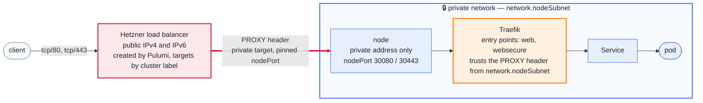

# The network

How a packet gets where it is going, and what stops one that should not. The
rest of the design — what owns what, the layers, the output contract — is
[design.md](design.md); the field that picks between the two routing modes is
[configuration.md](configuration.md#how-pod-traffic-crosses-nodes).

## The default deny is opt-in

`layers/20-network-policy` sits immediately after the CNI because Cilium is
what enforces its resources — the CRDs do not exist until the chart is
installed. What it carries is a `CiliumClusterwideNetworkPolicy` per flow the
cluster cannot lose — host to pod, pod to DNS, pod to the API server through
KubePrism, scraping, the few pod-to-pod paths the platform uses, cert-manager
reaching Let's Encrypt, the CSI driver and the cloud controller manager
reaching `api.hetzner.cloud`, and Argo CD reaching the repositories and charts
it reconciles — and one default deny, separately.

`network-policy:enabled` is `false` by default, and that is not timidity. In
Cilium, *any* policy that selects an endpoint puts that endpoint into
default-deny for the direction the policy mentions — so there is no such thing
as an allow rule that changes nothing, and a missing rule is a silent
connection timeout rather than a rejected apply. The allow policies therefore
set `enableDefaultDeny: {ingress: false, egress: false}`, which makes them
genuinely additive, and the deny is the one resource the flag gates.

With the allow policies applied and the deny still off, Cilium reports
something that reads like the opposite:

    $ cilium-dbg endpoint list
    ENDPOINT   POLICY (ingress)   POLICY (egress)
               ENFORCEMENT        ENFORCEMENT
    30         Enabled            Enabled

That is not the deny. `ENFORCEMENT` says the datapath now consults the
endpoint's policy map, which it does as soon as any policy selects the
endpoint; what the map contains is the question, and it contains a wildcard:

    $ cilium-dbg bpf policy get 30
    Allow    Ingress   ANY             ANY   24340727 bytes
    Allow    Egress    ANY             ANY     569433 bytes
    Allow    Ingress   reserved:host   ANY      62587 bytes

The first two lines are `enableDefaultDeny: false` doing its job. A default
deny is precisely the absence of those wildcards, so their presence — not the
word Enabled — is what says nothing is being dropped. `hubble observe
--verdict DROPPED` answers the same question from the other end, and needs no
interpreting.

Turn it on with the flows in front of you: `task cluster:hubble` prints what
the cluster is doing now.

### What turning it on actually found

It was turned on against the live dev cluster, and off again, twice. Three
things came out of that, and none of them was visible from the repository.

**The deny had never worked.** The policy was written with `ingress: []` and
`egress: []`, the API server accepted it, `pulumi up` reported success, and
Cilium rejected it in a status nothing read — `Valid=False: rule must have at
least one of Ingress, IngressDeny, Egress, EgressDeny`. Every flow kept the
verdict `policy-verdict:none`, which is no enforcement at all. The shape that
works is an empty *list of selectors*, `ingress: [{fromEndpoints: []}]`: the
section exists, so the endpoint enforces, and it permits nobody. `task
cluster:smoke` now reports a policy Cilium rejected, because an apply that
creates one says success.

**The allow set was one-directional.** A Hubble capture shows the side of a
flow that appeared in it, and a default deny enforces both. Five permissions
were half-written, and not one of the failures looked like policy: `kubectl
top` silently empty, every load balancer target unhealthy, Argo CD serving from
an empty cache, `task cluster:hubble` itself unable to reach the agents, and a
volume claim stuck on `DeadlineExceeded` because the CSI controller could not
resolve a name. The five rules are `35-allow-kubelet-clients`,
`45-allow-ingress-loadbalancer`, `46-allow-argocd-cache-egress`,
`47-allow-hubble-relay` and the second document in `10-allow-dns`.

**The last two flows were DNS, on both sides of it.** CoreDNS's own egress to
the resolver Talos runs on the node — every query for a name outside the
cluster — and egress to kube-dns's ClusterIP for the clients that are not
translated to a backend before policy is evaluated. Neither is written as the
address Hubble prints: the first is `toEntities: host`, because
`169.254.116.108` is a Talos implementation detail, and the second is
`toServices`, because the service CIDR is per-environment and a literal would
be right on one cluster and quietly wrong on the next. Both carry the same L7
block as the rule they sit beside, so DNS still goes through the proxy that
`toFQDNs` policies depend on — a plain L3 rule for port 53 would be the more
permissive one and Cilium would take it.

**And an eighth gap that sixteen minutes of watching did not show.** Traefik
had no egress to the workloads it routes to. Nothing reported it, because
nobody opened the Argo CD UI in those sixteen minutes — one request produced it
at once. From outside it looked like this: `curl https://argocd.<domain>/`
returning HTTP 000 while the TLS handshake completed and `openssl s_client`
printed a valid certificate, because Traefik terminates TLS and only then
cannot reach the backend. That rule is `48-allow-ingress-backends`, and it
permits every endpoint on purpose: an ingress controller's function is to reach
whatever an Ingress object names, so a rule listing today's backends breaks the
next one silently.

The lesson that keeps arriving: **a flow that happens on demand has to be
provoked, not waited for.** It was first written down for the Hetzner API,
found again here by opening a URL, and a quiet Hubble window means only that
nothing asked.

With all of them, the deny is **on** in dev: twenty-one policies, every smoke
check green, `kubectl top` answering, Hubble reaching all three agents, the
Argo CD UI answering HTTP 200 from the internet, and no denials in sixteen
minutes of flows.

The general lesson is cheaper than the way it was learned: when adding an
allow policy, write the client's egress and the server's ingress together, and
assume a capture showed you one of them.

### What each allow policy cost to write

Most of them were measured from Hubble on a live cluster, and two were not,
for opposite reasons worth knowing before adding a third.

`60-allow-hcloud-api` was missed entirely by the first two captures and found
only when a PersistentVolumeClaim provoked it: both clients call that API on
demand, so a capture is a window rather than an inventory. A flow that happens
on demand has to be provoked, not waited for.

`70-allow-argocd-git` could not be measured at all — `gitops:repoURL` is
unset, so the flow does not exist yet. It is written anyway, because the
alternative is that the first apply which sets that key looks like a broken
repository. It is also the one policy here that permits `toEntities: world`
rather than named hosts, and deliberately: Argo CD reaches the forge that key
names and every chart registry any child Application references, which is not
a set anybody can list in advance.

`80-allow-keda` is the third, and it is unmeasured for a third reason:
`kedaEnabled` is off, so the operator that would produce the flows is not
installed. Its ports come from the rendered chart rather than from Hubble — the
`metricsservice` port of the keda-operator Service is tcp/9666 — and its shape
from what KEDA's architecture requires: the operator polls the sources and the
metrics API server reads the values from it over gRPC. Verify it with
`task cluster:hubble` on the first cluster that sets the key.

It is also the one policy written narrower than it could be. KEDA can scale on
an external source, and a cluster that did would need `toEntities: world` here
for the same reason Argo CD has it. This one stops at `toEndpoints` inside the
cluster, so a ScaledObject pointed at the internet fails with a connection
error rather than working by accident — and widening it costs a commit that
says why.

The flow this was once also waiting for — Alertmanager reaching a receiver —
is not a gap today: no observability is installed, so there is nothing to
drop. It becomes one again the moment that arrives, which is why it is written
down here rather than only in a backlog.

## How a request reaches a pod

Two halves of one setting, and enabling either alone fails every request
through the load balancer. The load balancer is told to send a PROXY header;
Traefik accepts one only from addresses it is told to trust, and its default is
to trust nobody.

The load balancer is created by `layers/40-ingress` through the Hetzner
provider, not by the cloud controller manager. A Service of type LoadBalancer
would hand the job to the CCM, and that was measured to cost two things: the load balancer was invisible to `plan` and `destroy` and showed
up only in the bill, and it had no targets at all — the CCM will not target a
node carrying `node.kubernetes.io/exclude-from-external-load-balancers`, which
Talos puts on every control-plane node. So the Service is a `NodePort` on
pinned ports and the load balancer selects its targets by cluster label.



The trusted range is the node subnet the cluster tier publishes, not a wider
one: the load balancer reaches the nodes privately, and a wider range would
accept a spoofed header from any pod. Nothing trusts `X-Forwarded-*` in
addition — the client address arrives in the PROXY header, and trusting both
would accept a forged one.

## How pod traffic crosses a node boundary

This is the one piece of the design that a single-node cluster cannot test, and
it was wrong for as long as there was only one node to hide it.

A Hetzner private network is **routed, not switched**. Each server's private NIC
carries a `/32`, and the only on-link peer is the gateway:

```
eth1  inet 10.0.1.3/32
10.0.0.0/16 via 10.0.0.1 dev eth1
10.0.0.1 dev eth1 scope link
```

So a node has no way to reach another node's pod CIDR on its own. Two things can
supply one, and `network.routingMode` picks between them.

### native — the default

The hcloud CCM's route controller programmes one route per node inside the
Hetzner network:

```
10.244.0.0/24 -> 10.0.1.4
10.244.1.0/24 -> 10.0.1.2
10.244.2.0/24 -> 10.0.1.3
```

Those live in Hetzner's router, not in the node. For a pod packet to reach them
the node must send it to the gateway, so the cluster tier writes exactly that
into every machine config:

```yaml
machine:
  network:
    interfaces:
      - interface: eth1
        dhcp: true          # keeps the private address Hetzner hands out
        routes:
          - network: <podCIDR>
            gateway: <first address of ipRange>
```

The gateway is derived from `network.ipRange` rather than written as
`10.0.0.1`, which is correct only while the range keeps its default.

### tunnel — VXLAN between node addresses

`routingMode: tunnel` wraps pod packets in VXLAN, addressed node to node. It
needs nothing from the private network's routing and nothing from the CCM's
route controller — only that nodes can reach each other, which is the property
that stayed true throughout the failure below.

That makes it the right choice in two situations: when the private network's
routing is itself under suspicion, and on any provider whose network does not
route pod CIDRs at all. It also runs unfiltered here, because Hetzner Cloud
firewalls apply to the public interface only.

What it costs: about 50 bytes of header a packet, the MTU reduction that comes
with them, and encapsulated captures.

**Switching is a maintenance operation, not a toggle.** Every Cilium agent
restarts and pod traffic breaks while they do. It is one Helm value and no Talos
apply, because the gateway route is installed in *both* modes — under tunnel it
is simply never used, Cilium's own per-node routes being more specific.

### autoDirectNodeRoutes cannot work here, in either mode

It asks Cilium to install a route to a peer's pod CIDR *via that peer's
address*. On a `/32` with only the gateway on-link there is no such path, and
Cilium says so rather than guessing:

```
Unable to install direct node route
  route="{Dst: 10.244.0.0/24  Gw: 10.0.1.4}"
  error="route to destination 10.0.1.4 contains gateway 10.0.0.1,
         must be directly reachable"
Failed to apply node handler during background sync.
```

It was set to `true`, and the result was that pod-to-pod traffic across nodes
had **no route at all**. What that looked like, in order: CoreDNS on two nodes
unreachable from the third, so roughly a third of DNS queries timed out; the
hcloud CSI controller — scheduled on the node without a CoreDNS replica — unable
to resolve `api.hetzner.cloud`, hanging before it opened its gRPC socket; its
liveness probe therefore refused; kubelet killing it every twenty seconds
(`initialDelaySeconds: 10` plus `periodSeconds: 2` × `failureThreshold: 5`);
and its three sidecars exiting behind it with "Lost connection to CSI driver".
706 restarts, and the only visible symptom was that no volume could be
provisioned.

The flag the error message suggests, `direct-routing-skip-unreachable`, is not
a fix. It stops Cilium retrying a route that cannot work and leaves the traffic
with nowhere to go — quieter logs, same broken cluster.

The cheapest check that would have caught all of it is `cilium-health status`,
which reported `1/3 reachable` with node-level reachability at `1/1` and
endpoint-level at `0/1` for both peers — host paths fine, pod paths dead.
