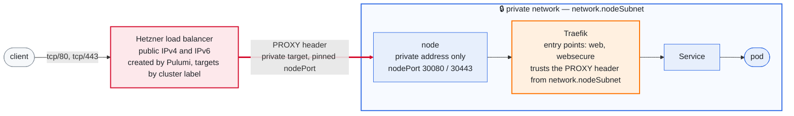

# The network

How a packet gets where it is going, and what stops one that should not. The
rest of the design — what owns what, the layers, the output contract — is
[design.md](design.md); the field that picks between the two routing modes is
[configuration.md](configuration.md#how-pod-traffic-crosses-nodes).

## The default deny is opt-in

`layers/20-network-policy` sits immediately after the CNI because Cilium is
what enforces its resources — the CRDs do not exist until the chart is
installed. What it carries is a `CiliumClusterwideNetworkPolicy` per flow the
cluster cannot lose (host to pod, pod to DNS, pod to the API server through
KubePrism, scraping, the few pod-to-pod paths the platform actually uses) and
one default deny, separately.

`network-policy:enabled` is `false` by default, and that is not timidity. In
Cilium, *any* policy that selects an endpoint puts that endpoint into
default-deny for the direction the policy mentions — so there is no such thing
as an allow rule that changes nothing, and a missing rule is a silent
connection timeout rather than a rejected apply. The allow policies therefore
set `enableDefaultDeny: {ingress: false, egress: false}`, which makes them
genuinely additive, and the deny is the one resource the flag gates.

With the allow policies applied and the deny still off, Cilium reports
something that reads like the opposite:

    $ cilium-dbg endpoint list
    ENDPOINT   POLICY (ingress)   POLICY (egress)
               ENFORCEMENT        ENFORCEMENT
    30         Enabled            Enabled

That is not the deny. `ENFORCEMENT` says the datapath now consults the
endpoint's policy map, which it does as soon as any policy selects the
endpoint; what the map contains is the question, and it contains a wildcard:

    $ cilium-dbg bpf policy get 30
    Allow    Ingress   ANY             ANY   24340727 bytes
    Allow    Egress    ANY             ANY     569433 bytes
    Allow    Ingress   reserved:host   ANY      62587 bytes

The first two lines are `enableDefaultDeny: false` doing its job. A default
deny is precisely the absence of those wildcards, so their presence — not the
word Enabled — is what says nothing is being dropped. `hubble observe
--verdict DROPPED` answers the same question from the other end, and needs no
interpreting.

Turn it on with the flows in front of you: `task cluster:hubble` prints what
the cluster is doing now.

## How a request reaches a pod

Two halves of one setting, and enabling either alone fails every request
through the load balancer. The load balancer is told to send a PROXY header;
Traefik accepts one only from addresses it is told to trust, and its default is
to trust nobody.

The load balancer is created by `layers/40-ingress` through the Hetzner
provider, not by the cloud controller manager. A Service of type LoadBalancer
would hand the job to the CCM, and that was measured to cost two things: the load balancer was invisible to `plan` and `destroy` and showed
up only in the bill, and it had no targets at all — the CCM will not target a
node carrying `node.kubernetes.io/exclude-from-external-load-balancers`, which
Talos puts on every control-plane node. So the Service is a `NodePort` on
pinned ports and the load balancer selects its targets by cluster label.



The trusted range is the node subnet the cluster tier publishes, not a wider
one: the load balancer reaches the nodes privately, and a wider range would
accept a spoofed header from any pod. Nothing trusts `X-Forwarded-*` in
addition — the client address arrives in the PROXY header, and trusting both
would accept a forged one.

## How pod traffic crosses a node boundary

This is the one piece of the design that a single-node cluster cannot test, and
it was wrong for as long as there was only one node to hide it.

A Hetzner private network is **routed, not switched**. Each server's private NIC
carries a `/32`, and the only on-link peer is the gateway:

```
eth1  inet 10.0.1.3/32
10.0.0.0/16 via 10.0.0.1 dev eth1
10.0.0.1 dev eth1 scope link
```

So a node has no way to reach another node's pod CIDR on its own. Two things can
supply one, and `network.routingMode` picks between them.

### native — the default

The hcloud CCM's route controller programmes one route per node inside the
Hetzner network:

```
10.244.0.0/24 -> 10.0.1.4
10.244.1.0/24 -> 10.0.1.2
10.244.2.0/24 -> 10.0.1.3
```

Those live in Hetzner's router, not in the node. For a pod packet to reach them
the node must send it to the gateway, so the cluster tier writes exactly that
into every machine config:

```yaml
machine:
  network:
    interfaces:
      - interface: eth1
        dhcp: true          # keeps the private address Hetzner hands out
        routes:
          - network: <podCIDR>
            gateway: <first address of ipRange>
```

The gateway is derived from `network.ipRange` rather than written as
`10.0.0.1`, which is correct only while the range keeps its default.

### tunnel — VXLAN between node addresses

`routingMode: tunnel` wraps pod packets in VXLAN, addressed node to node. It
needs nothing from the private network's routing and nothing from the CCM's
route controller — only that nodes can reach each other, which is the property
that stayed true throughout the failure below.

That makes it the right choice in two situations: when the private network's
routing is itself under suspicion, and on any provider whose network does not
route pod CIDRs at all. It also runs unfiltered here, because Hetzner Cloud
firewalls apply to the public interface only.

What it costs: about 50 bytes of header a packet, the MTU reduction that comes
with them, and encapsulated captures.

**Switching is a maintenance operation, not a toggle.** Every Cilium agent
restarts and pod traffic breaks while they do. It is one Helm value and no Talos
apply, because the gateway route is installed in *both* modes — under tunnel it
is simply never used, Cilium's own per-node routes being more specific.

### autoDirectNodeRoutes cannot work here, in either mode

It asks Cilium to install a route to a peer's pod CIDR *via that peer's
address*. On a `/32` with only the gateway on-link there is no such path, and
Cilium says so rather than guessing:

```
Unable to install direct node route
  route="{Dst: 10.244.0.0/24  Gw: 10.0.1.4}"
  error="route to destination 10.0.1.4 contains gateway 10.0.0.1,
         must be directly reachable"
Failed to apply node handler during background sync.
```

It was set to `true`, and the result was that pod-to-pod traffic across nodes
had **no route at all**. What that looked like, in order: CoreDNS on two nodes
unreachable from the third, so roughly a third of DNS queries timed out; the
hcloud CSI controller — scheduled on the node without a CoreDNS replica — unable
to resolve `api.hetzner.cloud`, hanging before it opened its gRPC socket; its
liveness probe therefore refused; kubelet killing it every twenty seconds
(`initialDelaySeconds: 10` plus `periodSeconds: 2` × `failureThreshold: 5`);
and its three sidecars exiting behind it with "Lost connection to CSI driver".
706 restarts, and the only visible symptom was that no volume could be
provisioned.

The flag the error message suggests, `direct-routing-skip-unreachable`, is not
a fix. It stops Cilium retrying a route that cannot work and leaves the traffic
with nowhere to go — quieter logs, same broken cluster.

The cheapest check that would have caught all of it is `cilium-health status`,
which reported `1/3 reachable` with node-level reachability at `1/1` and
endpoint-level at `0/1` for both peers — host paths fine, pod paths dead.
