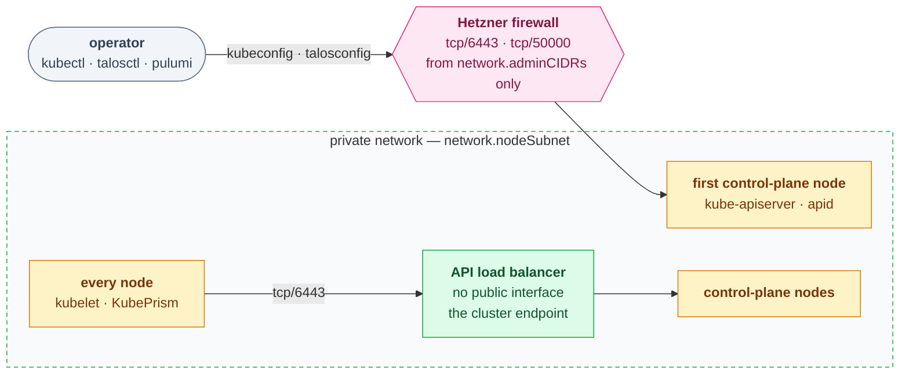

# The network

How a packet gets where it is going, and what stops one that should not. The
rest of the design — what owns what, the layers, the output contract — is
[design.md](design.md); the field that picks between the two routing modes is
[configuration.md](configuration.md#how-pod-traffic-crosses-nodes).

## The default deny is opt-in

`layers/20-network-policy` sits immediately after the CNI because Cilium is
what enforces its resources — the CRDs do not exist until the chart is
installed. What it carries is a `CiliumClusterwideNetworkPolicy` per flow the
cluster cannot lose — host to pod, pod to DNS, pod to the API server through
KubePrism, scraping, the few pod-to-pod paths the platform uses, cert-manager
reaching Let's Encrypt, the CSI driver and the cloud controller manager
reaching `api.hetzner.cloud`, and Argo CD reaching the repositories and charts
it reconciles — and one default deny, separately.

`network-policy:enabled` is `false` by default. In Cilium, *any* policy that
selects an endpoint puts that endpoint into default-deny for the direction the
policy mentions — so there is no such thing as an allow rule that changes
nothing, and a missing rule is a silent connection timeout rather than a
rejected apply. The allow policies therefore set
`enableDefaultDeny: {ingress: false, egress: false}`, which makes them
genuinely additive, and the deny is the one resource the flag gates.

With the allow policies applied and the deny still off, Cilium reports
something that reads like the opposite:

    $ cilium-dbg endpoint list
    ENDPOINT   POLICY (ingress)   POLICY (egress)
               ENFORCEMENT        ENFORCEMENT
    30         Enabled            Enabled

That is not the deny. `ENFORCEMENT` says the datapath now consults the
endpoint's policy map, which it does as soon as any policy selects the
endpoint; what the map contains is the question, and it contains a wildcard:

    $ cilium-dbg bpf policy get 30
    Allow    Ingress   ANY             ANY   24340727 bytes
    Allow    Egress    ANY             ANY     569433 bytes
    Allow    Ingress   reserved:host   ANY      62587 bytes

The first two lines are `enableDefaultDeny: false` doing its job. A default
deny is precisely the absence of those wildcards, so their presence — not the
word Enabled — is what says nothing is being dropped. `hubble observe
--verdict DROPPED` answers the same question from the other end.

Turn it on with the flows in front of you: `task cluster:hubble` prints what
the cluster is doing now.

### The shape of the deny

An empty rule list — `ingress: []`, `egress: []` — is accepted by the API
server and rejected by Cilium in a status nothing reads, so it enforces
nothing. The shape that works is an empty *list of selectors*,
`ingress: [{fromEndpoints: []}]`: the section exists, so the endpoint
enforces, and it permits nobody. `task cluster:smoke` reports any policy
Cilium rejected, because an apply that creates one says success.

### Writing an allow policy

**Write the client's egress and the server's ingress together.** A Hubble
capture shows the side of a flow that appeared in it, and a default deny
enforces both. A half-written rule rarely looks like policy: `kubectl top`
empty, load balancer targets unhealthy, a volume claim stuck on
`DeadlineExceeded` because the CSI controller could not resolve a name.

**Provoke a flow; do not wait for it.** A capture is a window, not an
inventory. A flow that happens on demand — the CSI driver calling the Hetzner
API (`60-allow-hcloud-api`), the Hubble UI dialling the relay
(`47-allow-hubble-ui`) — appears only when something asks for it. A flow that
happens only at start — the CSI node plugin reading its location from the
metadata service (`61-allow-hcloud-metadata`) — appears only on a restart, and
pods started before the deny keep running without it until a rollout.

**DNS is allowed on both sides.** CoreDNS's egress to the resolver Talos runs
on the node is `toEntities: host`, because that resolver's link-local address
is a Talos implementation detail. Egress to kube-dns's ClusterIP, for clients
not translated to a backend before policy is evaluated, is `toServices`,
because the service CIDR is per-environment. Both carry the same L7 block as
the rule beside them, so DNS still goes through the proxy that `toFQDNs`
policies depend on — a plain L3 rule for port 53 would be the more permissive
one, and Cilium would take it.

**Three policies are wider or narrower than the rest, on purpose:**

- `48-allow-ingress-backends` lets Traefik reach every endpoint. An ingress
  controller reaches whatever an Ingress object names, so a rule listing
  today's backends breaks the next one silently. Without it, TLS completes and
  the request then fails, because Traefik terminates TLS before it dials the
  backend.
- `70-allow-argocd-git` permits `toEntities: world`: Argo CD reaches the forge
  `gitops:repoURL` names and every chart registry any child Application
  references, which nobody can list in advance. It is unmeasured — the key is
  unset, so the flow does not exist yet — and written anyway so the first apply
  that sets it does not look like a broken repository.
- `80-allow-keda` stops at `toEndpoints` inside the cluster, so a ScaledObject
  pointed at an external source fails with a connection error rather than
  working by accident; widening it is a commit that says why. Its ports come
  from the rendered chart (the keda-operator Service's `metricsservice` port,
  tcp/9666), not from Hubble, because `kedaEnabled` is off. Verify it with
  `task cluster:hubble` on the first cluster that sets the key.

## How a request reaches a pod

Two halves of one setting, and enabling either alone fails every request
through the load balancer. The load balancer is told to send a PROXY header;
Traefik accepts one only from addresses it is told to trust, and its default is
to trust nobody.

The load balancer is created by `layers/40-ingress` through the Hetzner
provider, not by the cloud controller manager — why is in
[design.md](design.md#what-lives-inside-what). So the Service is a `NodePort`
on pinned ports and the load balancer selects its targets by cluster label.


```mermaid
flowchart LR
    client(["<b>client</b>"])
    lb["<b>Hetzner load balancer</b><br/>public IPv4 and IPv6<br/>created by Pulumi, targets by cluster label"]

    subgraph private ["private network — network.nodeSubnet"]
        direction LR
        node["<b>node</b><br/>private address only<br/>nodePort 30080 · 30443"]
        traefik["<b>Traefik</b><br/>entry points: web · websecure<br/>trusts the PROXY header from network.nodeSubnet"]
        svc["<b>Service</b>"]
        pod["<b>pod</b>"]
    end

    client -->|"tcp/80 · tcp/443"| lb
    lb ==>|"PROXY header<br/>private target, pinned nodePort"| node
    node --> traefik
    traefik --> svc
    svc --> pod

    classDef actor fill:#F1F5F9,stroke:#64748B,color:#334155
    classDef optional fill:#F1F5F9,stroke:#64748B,color:#334155,stroke-dasharray:5 4
    classDef hetzner fill:#DCFCE7,stroke:#16A34A,color:#14532D
    classDef talos fill:#FEF3C7,stroke:#D97706,color:#78350F
    classDef kube fill:#DBEAFE,stroke:#2563EB,color:#1E3A8A
    classDef state fill:#EDE9FE,stroke:#7C3AED,color:#3B0764
    classDef gate fill:#FCE7F3,stroke:#DB2777,color:#831843
    class client actor
    class lb,node hetzner
    class traefik,svc,pod kube
    style private fill:#F8FAFC,stroke:#16A34A,stroke-dasharray:5 4

    %% The hop that carries the PROXY header. Indexed by edge order, so adding
    %% an edge above this one moves it.
    linkStyle 1 stroke:#DB2777,stroke-width:3px
```

The trusted range is the node subnet the cluster tier publishes, not a wider
one: the load balancer reaches the nodes privately, and a wider range would
accept a spoofed header from any pod. Nothing trusts `X-Forwarded-*` in
addition — the client address arrives in the PROXY header, and trusting both
would accept a forged one.

## How the Kubernetes API is reached

Two paths, and only one of them is public.


```mermaid
flowchart LR
    operator(["<b>operator</b><br/>kubectl · talosctl · pulumi"])
    fw{{"<b>Hetzner firewall</b><br/>tcp/6443 · tcp/50000<br/>from network.adminCIDRs only"}}

    subgraph private ["private network — network.nodeSubnet"]
        direction LR
        cp0["<b>first control-plane node</b><br/>kube-apiserver · apid"]
        nodes["<b>every node</b><br/>kubelet · KubePrism"]
        apilb["<b>API load balancer</b><br/>no public interface<br/>the cluster endpoint"]
        cps["<b>control-plane nodes</b>"]
    end

    operator -->|"kubeconfig · talosconfig"| fw
    fw --> cp0
    nodes -->|"tcp/6443"| apilb
    apilb --> cps

    classDef actor fill:#F1F5F9,stroke:#64748B,color:#334155
    classDef optional fill:#F1F5F9,stroke:#64748B,color:#334155,stroke-dasharray:5 4
    classDef hetzner fill:#DCFCE7,stroke:#16A34A,color:#14532D
    classDef talos fill:#FEF3C7,stroke:#D97706,color:#78350F
    classDef kube fill:#DBEAFE,stroke:#2563EB,color:#1E3A8A
    classDef state fill:#EDE9FE,stroke:#7C3AED,color:#3B0764
    classDef gate fill:#FCE7F3,stroke:#DB2777,color:#831843
    class operator actor
    class fw gate
    class apilb hetzner
    class cp0,nodes,cps talos
    style private fill:#F8FAFC,stroke:#16A34A,stroke-dasharray:5 4
```

The API load balancer has no public interface. A Hetzner firewall attaches to
servers, not to a load balancer, and the load balancer reaches its targets over
the private network, so a public interface on it would be tcp/6443 open to
everyone beside a firewall that admits only `network.adminCIDRs`. The nodes
reach the API through its private address; an operator reaches the first
control-plane node directly, where the firewall decides. Why the load balancer
is the cluster endpoint at all is in
[design.md](design.md#three-control-planes-and-etcd-on-the-private-network).

kubectl does not fail over, so the kubeconfig carries a context per
control-plane node, every one signed into the apiserver certificate. When the
first is down:

```bash
kubectl config use-context admin@<cluster>-control-plane-1
talosctl -e <another node's address> -n <another node's address> version
```

The talosconfig keeps one endpoint: with several listed and the first one
silent, as a powered-off server is, talosctl times out rather than moving to
the next.

## How pod traffic crosses a node boundary

A single-node cluster cannot test this.

A Hetzner private network is **routed, not switched**. Each server's private NIC
carries a `/32`, and the only on-link peer is the gateway:

```
eth1  inet 10.0.1.3/32
10.0.0.0/16 via 10.0.0.1 dev eth1
10.0.0.1 dev eth1 scope link
```

So a node has no way to reach another node's pod CIDR on its own. Two things can
supply one, and `network.routingMode` picks between them.

### native — the default

The hcloud CCM's route controller programmes one route per node inside the
Hetzner network:

```
10.244.0.0/24 -> 10.0.1.4
10.244.1.0/24 -> 10.0.1.2
10.244.2.0/24 -> 10.0.1.3
```

Those live in Hetzner's router, not in the node. For a pod packet to reach them
the node must send it to the gateway, so the cluster tier writes exactly that
into every machine config:

```yaml
machine:
  network:
    interfaces:
      - interface: eth1
        dhcp: true          # keeps the private address Hetzner hands out
        routes:
          - network: <podCIDR>
            gateway: <first address of ipRange>
```

The gateway is derived from `network.ipRange` rather than written as
`10.0.0.1`, which is correct only while the range keeps its default.

### tunnel — VXLAN between node addresses

`routingMode: tunnel` wraps pod packets in VXLAN, addressed node to node. It
needs nothing from the private network's routing and nothing from the CCM's
route controller — only that nodes can reach each other.

That makes it the right choice in two situations: when the private network's
routing is itself under suspicion, and on any provider whose network does not
route pod CIDRs at all. It also runs unfiltered here, because Hetzner Cloud
firewalls apply to the public interface only.

What it costs: about 50 bytes of header a packet, the MTU reduction that comes
with them, and encapsulated captures.

**Switching is a maintenance operation, not a toggle.** Every Cilium agent
restarts and pod traffic breaks while they do. It is one Helm value and no Talos
apply, because the gateway route is installed in *both* modes — under tunnel it
is simply never used, Cilium's own per-node routes being more specific.

### autoDirectNodeRoutes cannot work here, in either mode

It asks Cilium to install a route to a peer's pod CIDR *via that peer's
address*. On a `/32` with only the gateway on-link there is no such path, and
Cilium says so rather than guessing:

```
Unable to install direct node route
  route="{Dst: 10.244.0.0/24  Gw: 10.0.1.4}"
  error="route to destination 10.0.1.4 contains gateway 10.0.0.1,
         must be directly reachable"
Failed to apply node handler during background sync.
```

With it on, pod-to-pod traffic across nodes has **no route at all**, while
every node stays `Ready` and every pod `Running`. The signature is DNS: queries
time out from any node without a local CoreDNS replica, so a pod there that
resolves a name at start — the hcloud CSI controller resolving
`api.hetzner.cloud` — never opens its socket, fails its liveness probe and
crash-loops. The visible symptom is that no volume can be provisioned.

The flag the error message suggests, `direct-routing-skip-unreachable`, is not
a fix. It stops Cilium retrying a route that cannot work and leaves the traffic
with nowhere to go — quieter logs, same broken cluster.

The cheapest check is `cilium-health status`: host paths reachable and
endpoint paths not means pod routing is dead.
